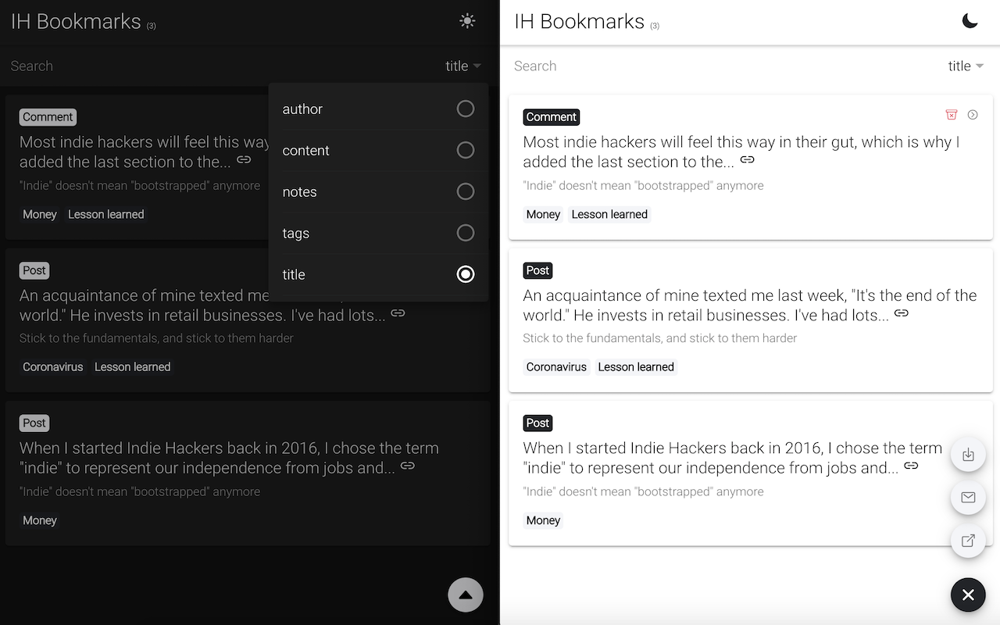

# ih-bookmarks

> Third-party solution for bookmarking posts and comments on Indie Hackers



## Features

- Dark mode!
- Tagging bookmark
- Add notes to bookmark
- Export bookmarks as .csv file
- Open in stand-alone tab for better viewing experience
- Search bookmarks by tags, notes, author, title and content

## Getting Started

Run the following commands to install dependencies and start developing

```
npm install
npm run dev
```

## Build

Run the following command to build the production-ready unpacked extension

```
npm run build
```
